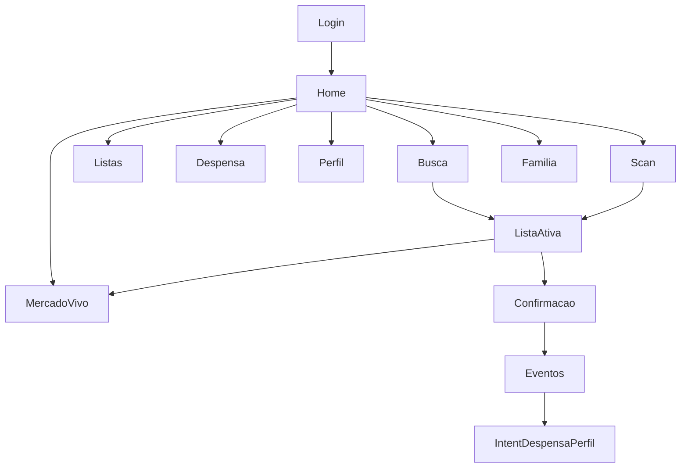
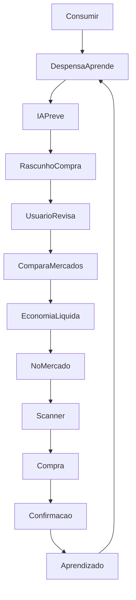
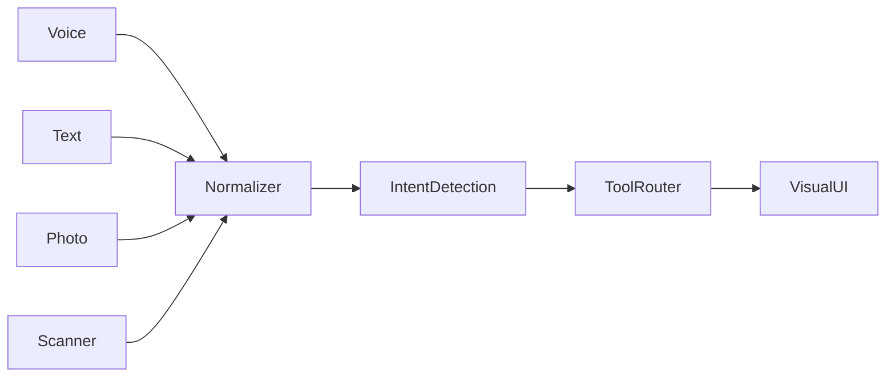
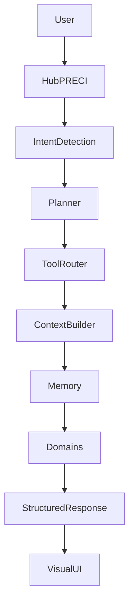

# Proposta — AI Native Shopping Journey (PRECIVOX B2C)

**Versão:** 1.0  
**Data:** 28/07/2026  
**Status:** Aprovada para documentação · implementação incremental por fases  
**Verdade de negócio:** [`docs/PRD_PRECIVOX.md`](./PRD_PRECIVOX.md) permanece canônico  
**Escopo:** apenas jornada CLIENTE (necessidade de reposição → confirmação da compra)  
**Fora de escopo:** Gestor, Admin, SaaS, billing, catálogo B2B, backoffice

---

## Princípio-mestre

> O usuário **nunca** deve sentir que está usando Inteligência Artificial.  
> Deve sentir apenas que o aplicativo: sabe o que a casa precisa, exige menos esforço, economiza tempo e ajuda a decidir melhor.

A IA é uma **capacidade da plataforma**, não a protagonista da interface.  
Isso diferencia um produto AI-Native de um produto que “ganhou um chatbot”.

### Princípios derivados (obrigatórios)

| # | Princípio | Implicação |
|---|-----------|------------|
| P0 | IA invisível | Copy sem “IA”, “agente”, “chatbot”; microcopy de tarefa |
| P1 | Intent-first | Perguntar “qual a intenção?”, nunca “em qual página?” |
| P2 | Casa no centro | Toda memória e previsão no escopo da casa, não só do usuário |
| P3 | Domínio intocado | EL, Lista, Casa, PRECI, Despensa, Mercado Ao Vivo, Scanner, Truth, Intent, Cesta Provável **permanecem** |
| P4 | Visual onde importa | Comparativos, mapas, EL detalhada, listas, scanner, corredores = UI visual |
| P5 | Zero Friction | 3 toques ou 1 frase; teclado por último; scanner a 1 toque |

### Zero Friction — 8 regras

1. Funcionalidade crítica em **≤ 3 toques** ou **uma frase**.
2. Prioridade de entrada: **Contexto → IA → Voz → Scanner → Foto → Toque → Teclado**.
3. Nunca obrigar o usuário a procurar funcionalidades — o sistema entende a intenção.
4. Toda recomendação **explicável** (nunca “a IA recomenda”).
5. Comparativos, mapas, gráficos e listas **permanecem visuais**; o orquestrador conduz até eles.
6. **Scanner** nunca a mais de **um toque**.
7. Funcionalidade principal: toque + voz (+ câmera quando possível).
8. A capacidade preditiva **sugere**; nunca interrompe com modal obrigatório de “IA”.

---

## 1. Auditoria da experiência atual

### 1.1 Achados

| Achado | Evidência | Impacto |
|--------|-----------|---------|
| IA de informação por **páginas** (5 abas) | `components/cliente/cliente-nav-items.ts` | Usuário pensa em “onde clicar”, não em intenção |
| Centro de gravidade = Busca/Lista | Home CTA → `/cliente/busca`; `ListaContext` | Compra é o eixo; ciclo alimentar fica secundário |
| Minha Casa é página lateral | `/cliente/familia` fora da bottom nav | Casa não é o centro do produto |
| Perfil PRECI é tela | `/cliente/perfil` | Cérebro exposto; deveria ser silencioso |
| Despensa = inventário | `/cliente/despensa` + status ok/atenção/acabando | Falta linguagem preditiva (“dura 3 dias”) |
| Home = dashboard de cards | `app/cliente/home/page.tsx` | Inteligência espalhada; não unifica intenção |
| Scan não é 1-tap global | Atalhos em home/busca; `/cliente/scan` | Viola Regra 6 |
| Multimodal ausente | Sem Web Speech / voz no código | Entrada = teclado/toque |
| Orquestração agentic parcial | Gateway: analyze-list, alternatives, route; Intent/cesta/EL em libs | Falta Intent Detection unificado + Tool Router B2C |
| Gaps conhecidos | `/cliente/listas/[id]` ausente; alertas/comparar/relatorios/referral mock | Dívida; não bloqueia reorganização |

### 1.2 O que já é AI-capable (preservar — não reconstruir)

| Capacidade | Módulo / superfície |
|------------|---------------------|
| Economia Líquida™ | `lib/economia-liquida.ts`, chips, lista, scan |
| Ranking híbrido | `lib/ranking-busca-hibrido.ts`, `/cliente/busca` |
| Cesta provável / semana | `lib/cesta-provavel.ts`, `lib/cesta-semana.ts` |
| Despensa inferida | `lib/despensa-digital.ts` (`diasRestantes`, `status`) |
| Truth layer + crowd | `lib/estoque-truth.ts`, `PrecoCrowdActions` |
| Mercado Ao Vivo + geofence | `/cliente/mercado-vivo`, watchers no layout |
| Scan OCR / EAN | `/cliente/scan`, `lib/scan-inteligente.ts` |
| Perfil PRECI + Intent Score | `lib/perfil-preci.ts`, `lib/ai/intent-score-engine.ts` |
| Troca inteligente / basket | `lib/troca-inteligente.ts`, basket-completion |
| Eventos comportamentais | `lib/ai/event-collector.ts`, `POST /api/events/track` |
| Minha Casa (raio familiar) | `lib/raio-familiar.ts`, `/cliente/familia` |
| Lista Inteligente | `ListaContext`, `ListaInteligentePanel` |

### 1.3 Shell atual

```
Bottom nav: Início | Buscar | Listas | Despensa | Perfil
Rotas satélite: scan, mercado-vivo, familia, produto/[id], comparar*, alertas*, relatorios*, referral*
(* mock / parcial)
```

---

## 2. Mapa das jornadas existentes



### Jornadas reais (acesso por página, não por intenção)

| ID | Jornada | Entrada típica | Saída |
|----|---------|----------------|-------|
| A | Montar lista via busca | `/cliente/busca` | Lista ativa |
| B | Cesta da semana 1-tap | Card home | Lista preenchida |
| C | Modo emergência | Card home | ≤5 itens |
| D | Scan in-store | Atalho / `/cliente/scan` | Item + crowd opcional |
| E | Corredor geofence | Watcher / `/cliente/mercado-vivo` | Checklist + confirmação |
| F | Crowd na etiqueta | Card produto / scan | Truth atualizado |
| G | Casa compartilhada | `/cliente/familia` | Lista sync membros |

Todas continuam existindo; a transformação **reorganiza o acesso** (intent → superfície), não remove jornadas.

---

## 3. Novo mapa — Jornada AI Native



### Posicionamento

O PRECIVOX deixa de ser percebido como comparador ou “plataforma de inteligência”.  
Passa a ser o **copiloto inteligente da alimentação da família** — acompanhar o ciclo alimentar contínuo, não só o momento da compra.

Hub PRECI e superfícies visuais (lista, comparativo, EL, scan, corredor) são **consequência da intenção**.

---

## 4. Nova Information Architecture

**Unidade semântica central: Casa** (não Usuário isolado).

```
Minha Casa (contexto + memória)
├── Ciclo agora (próxima compra / no mercado / pós-compra)
├── Despensa (memória operacional preditiva)
├── Compra ativa (Lista Inteligente — rascunho revisável)
├── Hub PRECI (entrada multimodal de intenções)
├── Capacidades (não “páginas primárias”)
│   ├── Buscar / Comparar (visual)
│   ├── Scanner (sempre 1 toque)
│   ├── Mercado Ao Vivo
│   ├── Economia Líquida (explicável, visual)
│   └── Histórico / streak / prova social
└── Conta (perfil conta + espelho PRECI avançado, raro)
```

| Conceito de domínio | Papel na IA | Nav? |
|---------------------|-------------|------|
| Minha Casa | Contexto + memória da família | Primária (Casa) |
| Lista Inteligente | Compra ativa / rascunho | Primária (Compra) |
| Despensa | Memória preditiva | Primária |
| Scanner | Entrada in-store / multimodal | FAB 1-tap |
| Hub PRECI | Intent entry | Barra na Casa (+ gesto) |
| Busca | Capability | Destino visual |
| Economia Líquida™ | Decisão explicável | Sheet / bloco visual |
| Perfil PRECI | Memory layer silenciosa | Mais (raro) |
| Intent Score | Sinal interno do ciclo | Não (cérebro) |
| Mercado Ao Vivo | Modo corredor | Capability / geofence |
| Truth / Crowd | Confiança de preço | Embutido nos cards |
| Cesta Provável / Semana | Rascunho automático | CTA Casa |

---

## 5. Nova navegação (mobile one-hand)

### Bottom nav (4 + FAB)

| Slot | Label | Rota canônica (nova) | Papel |
|------|--------|----------------------|--------|
| 1 | Casa | `/cliente/casa` (alias: home re-skin) | Ciclo, previsão, rascunho, Hub, membros |
| 2 | Compra | `/cliente/compra` (lista ativa full-bleed) | Revisar Lista Inteligente |
| 3 | **FAB Scanner** | `/cliente/scan` | Sempre 1 toque (Regra 6) |
| 4 | Despensa | `/cliente/despensa` | Memória preditiva |
| 5 | Mais | `/cliente/mais` | Conta, prefs EL, espelho PRECI, mercado vivo manual |

**Hub PRECI:** barra persistente no topo de Casa; também acessível por long-press no FAB ou gesto — **não** é 6ª aba.

### Compatibilidade de rotas (Fases 0–2)

| Rota atual | Destino na migração |
|------------|---------------------|
| `/cliente/home` | Casa / Agora (re-skin) ou redirect → `/cliente/casa` |
| `/cliente/busca` | Capability (Hub `ui.type=search_results`) — permanece funcional |
| `/cliente/listas` | Compra + histórico de listas |
| `/cliente/perfil` | Mais → Preferências / espelho PRECI |
| `/cliente/familia` | Promovida / fundida no shell Casa |
| `/cliente/scan` | FAB global (mesma página) |
| `/cliente/mercado-vivo` | Capability + geofence |

Feature flag: `AI_NATIVE_SHELL` (env / cookie / remote config). Dual-shell até Fase 9.

---

## 6. Novo papel da Home

Home atual → **Casa → “Agora”** (status do ciclo, não feed de features).

### Hierarquia visual (viewport 1)

1. Saudação da casa (“Casa da Ana”)
2. Status do ciclo em uma linha (“Provável compra em ~2 dias” / “Você está no Empório”)
3. **CTA primário:** Revisar compra sugerida (cesta da semana / cesta provável)
4. **Hub PRECI:** “O que a casa precisa?”
5. Contexto compacto: economia da casa, streak
6. Progressive disclosure: emergência, espera que vale, atacado, PRECI Index, share — **mesma lógica de negócio**

### O que a Home deixa de ser

- Dashboard de descoberta de features
- Lugar onde o usuário “escolhe o módulo”

### O que a Home passa a ser

- Resposta à pergunta: **“O que a casa precisa agora?”**

---

## 7. Novo papel da Minha Casa

De página satélite `/familia` → **shell principal do produto**.

### Modelo mental (dados reaproveitam domínio existente)

| Atributo da casa | Fonte atual / evolução |
|------------------|------------------------|
| Moradores | `raio-familiar` membros |
| Hábitos / frequência | Eventos + Intent Score agregado |
| Volume / “orçamento de volume” | `preferencias.volumeFamiliar` |
| Mercados favoritos | Check-ins, consolidação EL, âncoras |
| Restrições / marcas | Perfil PRECI eixos + prefs futuras |
| Despensa | `despensa-digital` por casa (evoluir de user→casa) |
| Listas | Lista compartilhada + `ListaContext` |
| Histórico / previsões | Confirmações, cesta provável, streak |

### Onboarding

1. Sem casa → criar ou entrar (fluxo já em `app/cliente/familia/page.tsx`).
2. Usuário solo → **casa de 1** automática (mesmo modelo; zero fricção).
3. Com `compartilharListas`, aprendizado no escopo dos membros.

---

## 8. Novo papel da Despensa

De inventário → **memória operacional preditiva**.

### Dados já disponíveis (`DespensaItem`)

- `cicloDias`, `diasDesdeUltimaCompra`, `diasRestantes`, `status` (`ok` | `atencao` | `acabando`)
- `fonte`: `inferido` | `manual`

### Linguagem operacional (UI — não inventar estoque)

| Condição | Copy sugerida |
|----------|---------------|
| `status === 'acabando'` ou `diasRestantes <= 0` | “Provavelmente acabou.” |
| `diasRestantes` 1–3 | “Deve durar mais ~{n} dias.” |
| `diasRestantes` ≈ 1 e intent alto | “Normalmente você compraria isso amanhã.” |
| `status === 'ok'` | “Em dia.” (secundário) |

### Ações

- **1-tap:** Incluir na compra → Lista / Cesta / recalcula EL
- CRUD manual **permanece**; deixa de ser o fluxo principal
- Alimenta automaticamente: Lista, EL, Compra da Semana, Cesta Provável, Lista Inteligente

---

## 9. Novo papel do Perfil PRECI

De tela de nav → **cérebro silencioso** (memory layer).

### Continua existindo (domínio)

- 5 eixos: planejador, marca, conveniência, explorador, urgente
- Intent Score (0–100, ~72h)
- Elasticidade / aceitação de substituição (ML leve + eventos)
- Preferências EL (valor hora, transporte)

### UI

- **Fora** da bottom nav primária
- Ajustes raros: Mais → “Preferências da casa”
- Espelho opcional “Por que sugerimos isso?” ligado a EL / substituição (Regra 4)
- Usuário quase nunca abre; o sistema usa continuamente no ranking, promos, cesta e Hub

---

## 10. Hub PRECI

Único ponto de entrada multimodal. **Não é chatbot.**

### Entradas → mesmo pipeline

Voz · Texto · Foto · Scanner → Normalizer → Intent Detection → Tools → **UI visual**

### Copy (P0)

| Evitar | Preferir |
|--------|----------|
| “Pergunte à IA” | “O que a casa precisa?” |
| “Assistente inteligente” | “Adicionar…” / “Montar compra da semana” |
| “O agente recomenda” | “Vale ir — economiza R$ X (~Y min)” |

### Chips de tarefa (não bolhas de chat)

- Montar compra da semana  
- Repetir última compra  
- Adicionar itens  
- Estou no mercado  
- Escanear etiqueta  

---

## 11. Arquitetura multimodal



| Modalidade | Tecnologia | Fase | Notas |
|------------|------------|------|-------|
| Texto | Input Hub | 4 | Baseline |
| Scanner | FAB → `/cliente/scan` + OCR/EAN existentes | 5 | Regra 6 |
| Voz | Web Speech API → texto → Hub | 6 | Atalho operacional, não conversa |
| Foto | Capture → pipeline OCR/scan | 8 | Reutiliza `scan-inteligente` / OCR client |

**Prioridade de entrada (Regra 2):** Contexto → predicao/Hub → Voz → Scanner → Foto → Toque → Teclado.

---

## 12. Arquitetura Agentic (orquestrador)



| Camada | Responsabilidade | Implementação alvo |
|--------|------------------|--------------------|
| Hub PRECI | UI de entrada multimodal | Componentes cliente |
| Intent Detection | Classificar intent + slots | Regras primeiro; LLM só se necessário |
| Planner | Sequência de tools | Determinístico por intent |
| Tool Router | Chamar APIs de domínio | BFF Next |
| Context Builder | Casa, lista ativa, geo, mercado | Sessão + APIs |
| Memory | PRECI, Intent, eventos, despensa | Libs existentes |
| Domains | EL, busca, lista, scan, … | `/api/cliente/*` intactas |
| StructuredResponse | Contrato tipado | Ver § Taxonomia |
| Visual UI | Renderer `ui.type` | Sheets / rotas capability |

**Novo seam BFF:** `POST /api/cliente/hub/intent`  
**Arquitetura:** RULE 1–4 — Hub no Next; Express só via `internalFetch`.  
**LLM:** parsing/explicação quando regras não bastarem; **decisão** (EL, ranking, intent score) permanece heurística.

---

## 13. Roadmap incremental de migração

Nenhuma funcionalidade existente deixa de funcionar. Dual-shell até depreciação segura.

| Fase | Nome | O que muda | O que NÃO muda | Critério de saída |
|------|------|------------|----------------|-------------------|
| **0** | Fundamentos | Este doc + taxonomy + flag `AI_NATIVE_SHELL` / `NEXT_PUBLIC_AI_NATIVE_SHELL` | Todas as rotas/APIs | Doc revisado; flag off em prod |
| **1** | Shell Casa | Nova nav; home = Agora; familia promovida — **código em dual-shell** | Busca, lista, APIs | Go-live §5 verde + nav usável one-hand |
| **2** | Compra-first | CTA = rascunho; criar lista manual secundário; `/listas/[id]` | Engines cesta | ≤3 toques até rascunho revisável |
| **3** | Despensa preditiva | Copy preditiva; 1-tap → lista | Core `despensa-digital` | Frases operacionais nos itens críticos |
| **4** | Hub PRECI v1 | Texto + intents regra-based → tools + renderer | Domínio | Top 5 intents → `ui.type` correto |
| **5** | Scanner global | FAB 1-tap em todo shell | Página scan | Regra 6 auditada em todas as abas |
| **6** | Voz | Speech → Hub | — | 3 frases de tarefa resolvem sem teclado |
| **7** | PRECI silencioso | Perfil fora da nav; memory-only | Cálculo eixos | Prefs só em Mais; ranking inalterado |
| **8** | Multimodal foto | Foto → Hub | OCR existente | Foto etiqueta = mesmo fluxo scan |
| **9** | Deprecate nav antiga | Redirects canônicos | URLs com redirect | Flag default on; nav antiga removida |

Detalhamento do checklist por fase: **§ Checklist Zero Friction e saída de fases** (abaixo).

---

## 14. Plano de migração UX (sem quebrar a base)

1. **Dual-shell:** `AI_NATIVE_SHELL` liga nova bottom nav; rotas antigas permanecem linkáveis.
2. **Capability routes:** `/cliente/busca` deixa de ser aba e vira destino do Hub (`ui.type=search_results` / `compare`).
3. **Lista:** continua `ListaContext` + `ListaInteligentePanel`; aba Compra = mesmo painel full-screen.
4. **Compat roles:** GESTOR/ADMIN seguem acessando `/cliente/*`.
5. **Copy:** estender `lib/ux-copy.ts` e `lib/ux-copy-casa.ts` — zero jargão IA/agente/chatbot.
6. **Gaps no caminho crítico:** implementar `/cliente/listas/[id]` na Fase 2; mocks (alertas, referral…) fora do caminho.
7. **Testes (seams do PRD):**
   - APIs B2C intactas
   - Domínio EL / PRECI / Intent determinístico
   - Jornadas: Casa → rascunho → revisão → corredor → confirmação
   - **Novo:** Hub intent → `StructuredResponse.ui.type` esperado
8. **Não remover** APIs `/api/cliente/*` existentes — Tool Router as consome.
9. **Geofence / Mercado Ao Vivo / crowd / truth** permanecem; só mudam pontos de entrada.

### Wireflow de migração mental (usuário antigo → novo)

| Antes (página) | Depois (intenção) |
|----------------|-------------------|
| Abrir Buscar, digitar leite | Hub: “Adiciona leite” / chip / scan |
| Abrir Listas → Nova | Casa: Revisar compra sugerida |
| Abrir Despensa, caçar item | Despensa: “Provavelmente acabou” → Incluir |
| Abrir Perfil para “ver IA” | Não precisa; preferências em Mais |
| Procurar Scan em Mais opções | FAB Scanner sempre visível |

---

## 15. Novas telas (após intents → fluxos → UI)

**Ordem obrigatória:** taxonomia de intents → fluxos → interfaces.

### 15.1 Telas / shells novos (mínimos)

| # | Tela | Intents que a abrem | Conteúdo |
|---|------|---------------------|----------|
| 1 | Casa / Agora | (default pós-login), `build_weekly` preview | Status ciclo + rascunho + Hub |
| 2 | Compra (revisão) | `add_items`, `repeat_last`, `build_weekly` | Lista Inteligente full-bleed |
| 3 | Hub PRECI | Qualquer entrada multimodal | Input + chips de tarefa (sem chat bubbles) |
| 4 | Despensa preditiva | `pantry_update`, deep link Casa | Timeline “acaba em / compre até” |
| 5 | FAB Scanner overlay | `scan`, Regra 6 | Abre scan existente |
| 6 | Mais | Conta / prefs | EL, espelho PRECI, mercado vivo manual |

### 15.2 Permanecem visuais (Regra 5) — Hub só conduz

- Comparação de mercados / preços  
- Cards de produto + truth + crowd  
- Lista Inteligente  
- Scanner / corredor Mercado Ao Vivo  
- Economia Líquida™ detalhada  
- Mapas / rota  
- Gráficos / histórico / streak  

### 15.3 Conversacional / frase (atalho de tarefa — não chat)

- Montar / completar lista  
- Preço pontual / “quanto custa X em Y?”  
- Explicar EL  
- Repetir compra / compra semanal  
- Substituições  
- Atualizar despensa  
- Perguntas rápidas operacionais  

---

# Taxonomia de intents e contrato StructuredResponse

## Intents canônicos

| Intent ID | Exemplos de utterance | Slots | Tools de domínio (existentes) | `ui.type` |
|-----------|----------------------|-------|-------------------------------|-----------|
| `add_items` | “Adiciona leite”, “Coloca 2 arroz” | `items[]`, `qty?` | busca, lists, despensa | `lista_inteligente` |
| `price_query` | “Quanto custa arroz no Mercado do João?” | `produto`, `mercado?` | busca, truth, EL | `preco_card` \| `compare` |
| `build_weekly` | “Monte a compra da semana” | `casaId?` | cesta-semana, despensa, cesta-provavel | `rascunho_compra` |
| `repeat_last` | “Repete minha compra passada” | `listaId?` | lists / histórico | `lista_inteligente` |
| `recipe_or_occasion` | “Estou fazendo lasanha”, “Churrasco” | `ocasiao` \| `receita` | sugestões, basket-completion | `lista_inteligente` |
| `pantry_update` | “Acabou o café”, “Ainda tem leite” | `produto`, `estado` | despensa | `despensa` |
| `substitute` | “Tem opção mais barata?” | `produtoId`, `listaId?` | troca-inteligente | `substitute_sheet` |
| `el_explain` | “Vale ir nesse mercado?” | `origem`, `destino`, `cesta?` | economia-liquida | `el_detail` |
| `start_instore` | “Estou no mercado” | `unidadeId?` | modo-mercado-vivo, geofence | `mercado_vivo` |
| `scan` | (FAB / “Escanear”) | `mercadoId?` | scan-inteligente | `scanner` |
| `open_compare` | “Compara preços de café” | `produto` | busca comparativo | `compare` |
| `unknown` | — | `raw` | — | `hub_clarify` (chips, sem chat) |

### Regras de detecção (Fase 4 — sem LLM obrigatório)

1. Match por padrões/keywords + entidades de produto do catálogo local.  
2. Se geofence ativo e utterance ambígua → priorizar `start_instore` / `scan` / `add_items`.  
3. Se lista vazia e intent de compra semanal → `build_weekly`.  
4. LLM só para `recipe_or_occasion` / parsing rico quando score de regra &lt; limiar.  
5. Nunca retornar recomendação sem `explanation` preenchida (Regra 4).

## Contrato `StructuredResponse`

Seam: `POST /api/cliente/hub/intent`

### Request

```typescript
type HubIntentRequest = {
  /** Texto já normalizado (voz/OCR viram texto antes) */
  input: string;
  /** Origem da modalidade */
  modality: 'text' | 'voice' | 'photo' | 'scanner' | 'context';
  /** Contexto cliente */
  context: {
    casaId?: string;
    listaAtivaId?: string;
    mercadoId?: string;
    unidadeId?: string;
    geofenceAtivo?: boolean;
    coords?: { lat: number; lng: number } | null;
  };
  /** Opcional: intent forçado por chip de UI */
  intentHint?: HubIntentId;
};
```

### Response

```typescript
type HubIntentId =
  | 'add_items'
  | 'price_query'
  | 'build_weekly'
  | 'repeat_last'
  | 'recipe_or_occasion'
  | 'pantry_update'
  | 'substitute'
  | 'el_explain'
  | 'start_instore'
  | 'scan'
  | 'open_compare'
  | 'unknown';

type HubUiType =
  | 'lista_inteligente'
  | 'rascunho_compra'
  | 'preco_card'
  | 'compare'
  | 'despensa'
  | 'substitute_sheet'
  | 'el_detail'
  | 'mercado_vivo'
  | 'scanner'
  | 'search_results'
  | 'hub_clarify'
  | 'none';

type StructuredResponse = {
  intent: HubIntentId;
  confidence: number; // 0–1
  slots: Record<string, unknown>;
  toolsUsed: string[]; // ex: ['cesta-semana', 'economia-liquida']
  /** Sempre explicável — linguagem humana, sem “a IA recomenda” */
  explanation: string;
  ui: {
    type: HubUiType;
    /** Payload para o renderer (ids, itens, EL result, rota…) */
    payload: Record<string, unknown>;
    /** Rota capability opcional */
    href?: string;
  };
};
```

### Exemplos

**“Adiciona leite”**

```json
{
  "intent": "add_items",
  "confidence": 0.92,
  "slots": { "items": [{ "query": "leite", "qty": 1 }] },
  "toolsUsed": ["produtos/buscar", "lists"],
  "explanation": "Leite adicionado à compra da casa.",
  "ui": { "type": "lista_inteligente", "payload": { "added": ["…"] }, "href": "/cliente/compra" }
}
```

**“Vale ir no Empório?”**

```json
{
  "intent": "el_explain",
  "confidence": 0.88,
  "slots": { "destinoLabel": "Empório" },
  "toolsUsed": ["economia-liquida"],
  "explanation": "Vale ir — economiza cerca de R$ 12 (~15 min), já descontando deslocamento e tempo.",
  "ui": { "type": "el_detail", "payload": { "recomendacao": "ir", "el": 12.0 } }
}
```

### Renderer (cliente)

| `ui.type` | Ação UI |
|-----------|---------|
| `lista_inteligente` / `rascunho_compra` | Abrir Compra / atualizar `ListaContext` |
| `preco_card` / `compare` / `search_results` | Capability busca/comparativo |
| `el_detail` | Bottom sheet EL (detalhes numéricos) |
| `despensa` | Navegar Despensa + highlight item |
| `substitute_sheet` | Sheet troca inteligente |
| `mercado_vivo` | `/cliente/mercado-vivo` |
| `scanner` | `/cliente/scan` |
| `hub_clarify` | Mostrar chips de tarefa (sem thread de chat) |
| `none` | Toast com `explanation` apenas |

---

# Checklist Zero Friction e critérios de saída por fase

## Audit Zero Friction (aplicar em toda fase que toque UI)

| Regra | Pergunta de aceite | Falha se… |
|-------|-------------------|-----------|
| R1 | A tarefa crítica fecha em ≤3 toques ou 1 frase? | Precisa de 4+ telas ou formulário longo |
| R2 | Teclado é último recurso? | Fluxo principal força digitação |
| R3 | Usuário precisa caçar a feature no menu? | Feature só em Mais/escondida |
| R4 | Toda sugestão tem explicação humana? | Copy “recomendado pela IA” / sem motivo |
| R5 | Comparativo/EL/lista/scan continuam visuais? | Tentativa de resolver só em texto de chat |
| R6 | Scanner está a 1 toque de qualquer aba? | FAB ausente ou &gt;1 toque |
| R7 | Há caminho por toque e (quando fase) voz? | Só teclado |
| R8 | Predição sugere sem modal bloqueante de “IA”? | Interrompe fluxo obrigando dismiss de hype |

**P0 — IA invisível:** se a UI rotular “IA/agente/chatbot” como protagonista → **reprovar** e redesenhar.

## Critérios de saída detalhados por fase

### Fase 0 — Fundamentos

- [x] Documento desta proposta publicado
- [x] Flag `NEXT_PUBLIC_AI_NATIVE_SHELL` / cookie `AI_NATIVE_SHELL` (default off em prod via env)
- [x] Taxonomia de intents revisada no doc
- [x] PRD com adendo apontando esta proposta
- [x] Nenhuma rota removida

### Fase 1 — Shell Casa

- [x] Bottom nav: Casa | Compra | FAB Scan | Despensa | Mais (quando flag on)
- [x] Home re-skin = “Agora” em `/cliente/casa` (CTA rascunho + Hub placeholder)
- [x] `/familia` acessível a partir de Casa (membros/convite)
- [x] Flag off: nav antiga intacta
- [ ] `CHECKLIST_GO_LIVE.md` §5 cliente verde (validar em ambiente)
- [x] One-hand: alvos ≥44–56px; safe-area iOS; FAB Scanner

### Fase 2 — Compra-first

- [x] CTA primário Casa → rascunho (cesta semana/provável) em ≤3 toques
- [x] Criar lista vazia manual = secundário
- [x] `/cliente/listas/[id]` (+ `/editar`) implementada → ativa lista e abre Compra
- [x] `ListaContext` + painel intactos funcionalmente
- [x] Confirmação de compra na aba Compra (mesmo prompt da busca)

### Fase 3 — Despensa preditiva

- [x] Itens com `diasRestantes` mostram copy operacional
- [x] 1-tap “Incluir na compra” funciona (`/api/cliente/despensa/para-lista`)
- [x] CRUD manual preservado
- [x] Sem inventar quantidade física não inferida
- [x] Testes de copy em `tests/unit/despensa-copy.test.ts`

### Fase 4 — Hub PRECI v1

- [ ] `POST /api/cliente/hub/intent` retorna `StructuredResponse`
- [ ] Intents: `add_items`, `build_weekly`, `price_query`, `repeat_last`, `scan` com testes de seam
- [ ] Toda response tem `explanation` não vazia
- [ ] Renderer abre UI visual correta (não chat thread)
- [ ] Copy Hub sem jargão de IA

### Fase 5 — Scanner global

- [ ] FAB visível em Casa, Compra, Despensa, Mais
- [ ] 1 toque → câmera/scan
- [ ] Fluxo OCR/EAN/EL/crowd preservado

### Fase 6 — Voz

- [ ] Frases: “Adiciona leite”, “Monte a compra da semana”, “Quanto custa arroz?”
- [ ] Voz → mesmo endpoint Hub
- [ ] Falha de permissão → fallback toque/texto sem culpar usuário

### Fase 7 — PRECI silencioso

- [ ] Perfil fora da bottom nav
- [ ] Preferências em Mais
- [ ] Ranking/cesta/EL ainda usam eixos + intent
- [ ] Espelho “por quê?” opcional e explicável

### Fase 8 — Foto multimodal

- [ ] Foto no Hub usa pipeline scan/OCR
- [ ] Mesmo `StructuredResponse` que scanner

### Fase 9 — Deprecate nav antiga

- [ ] Redirects: `/cliente/home` → Casa; busca como capability
- [ ] Flag default **on**
- [ ] Nav antiga removida só após 1 ciclo de piloto estável
- [ ] Analytics: funil Casa → rascunho → confirmação ≥ baseline anterior

## Métricas de sucesso da transformação

| Métrica | Direção | Nota |
|---------|---------|------|
| Toques médios até “rascunho revisável” | ↓ | Alvo: ≤3 |
| % compras iniciadas por rascunho (vs lista vazia) | ↑ | Compra-first |
| Uso do FAB scan / semana | ↑ | Regra 6 |
| Taxa de confirmação pós-visita | ↑ | Ciclo fecha |
| Economia Líquida média aceita | ↑ / estável | Não piorar |
| Menção a “confuso / onde fica X” (NPS/qualitativo) | ↓ | IA invisível |
| Regressão go-live §5 | 0 | Gate duro |

---

## Pergunta final (obrigatória)

> Se estivéssemos criando o PRECIVOX do zero em 2026, para competir com empresas que nasceram na era dos agentes inteligentes, esta seria a experiência mais simples, rápida e natural possível para uma família fazer suas compras?

### Resposta

**Sim, com uma condição.**

O desenho remove a taxonomia de páginas como eixo mental, coloca a **Casa** e o **ciclo alimentar** no centro, torna a entrada **intent-driven / multimodal** e mantém decisão **visual** onde humanos comparam melhor (preço, EL, corredor).

A condição de honestidade: **Fases 0–4** (shell + rascunho + despensa preditiva + Hub texto + contratos) já entregam “app que sabe o que a casa precisa” **sem teatro de chatbot**. Voz e foto (Fases 5–8) são aceleradores, não o produto.

Qualquer UI que:

- rotule “IA” como protagonista,  
- force conversa para tarefas que devem ser visuais, ou  
- esconda o scanner  

**reprova** esta pergunta e deve ser redesenhada **antes** de implementar.

---

## Referências

| Documento | Uso |
|-----------|-----|
| [`PRD_PRECIVOX.md`](./PRD_PRECIVOX.md) | Regras de negócio canônicas |
| [`SPEC_ECONOMIA_LIQUIDA.md`](./SPEC_ECONOMIA_LIQUIDA.md) | Fórmula EL |
| [`ROADMAP_PRECIVOX.md`](./ROADMAP_PRECIVOX.md) | Épicos e baseline |
| [`CHECKLIST_GO_LIVE.md`](./CHECKLIST_GO_LIVE.md) | QA piloto §5 |
| [`ARCHITECTURE.md`](../ARCHITECTURE.md) | RULE 1–4 BFF |
| `lib/ux-copy.ts` / `lib/ux-copy-casa.ts` | Copy B2C |

---

*Proposta AI Native Shopping Journey v1.0 — reorganiza experiência; não reconstrói domínio. Baseline jul/2026.*
