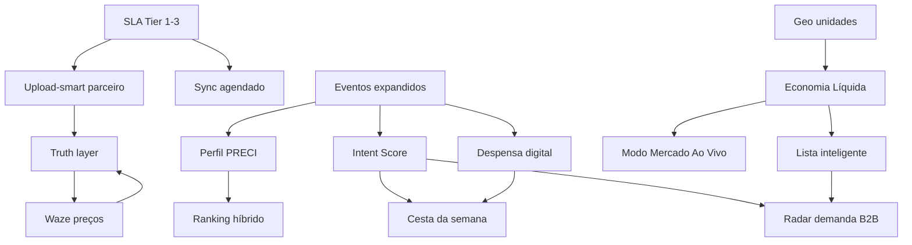

# Roadmap PRECIVOX — Inteligência de Consumo Alimentar

> **Tese:** O PRECIVOX oferta demanda ao consumidor (não espera).  
> **Categoria:** Infraestrutura de decisão de consumo — não comparador de preços.  
> **Princípios:** MVP first · baixo custo · IA híbrida · dados proprietários · IA explicável.

**Última atualização:** 11/06/2026  
**Horizonte:** 0–36 meses (MVP → escala → plataforma)  
**Fase operacional atual:** **Fase 3 — Escala** (Épico 12 ✅; Épico 13 em entrega; próximo: 14 Crowd v2)  
**Handoff detalhado:** [`CHECKPOINT_ROADMAP_MAIO2026.md`](./CHECKPOINT_ROADMAP_MAIO2026.md)

---

## Legenda

| Símbolo | Significado |
|---------|-------------|
| ✅ | Já existe no produto (base utilizável) |
| 🟡 | Parcial / precisa evoluir |
| 🔲 | A construir |
| P0 | Crítico para MVP da visão |
| P1 | Alto impacto pós-MVP inicial |
| P2 | Escala / moat |
| P3 | Visão unicórnio |

---

## Estado atual (baseline técnico) — maio/2026

| Área | Status | Referência no produto |
|------|--------|------------------------|
| Upload / integração catálogo parceiro | ✅ | `upload-smart`, `lib/upload-handler.ts`, `logs_importacao` |
| Sync agendado URL/SFTP | ✅ | `lib/sync-agendado.ts`, `SyncAgendadoCard`, cron/scheduler |
| SLA + contrato dados Tier 1–3 | ✅ | `lib/parceiro-sla.ts`, `ParceiroSlaCard`, `docs/PARCEIRO_SLA_CONTRATO.md` |
| Busca + lista inteligente + EL | ✅ | `/cliente/busca`, `ListaInteligentePanel`, `lib/economia-liquida.ts` |
| Truth layer (metadados + UI) | ✅ | `lib/estoque-truth.ts`, `PrecoTruthBadge` |
| Eventos comportamentais v2 | ✅ | `lib/ai/event-collector.ts`, `POST /api/events/track` |
| Crowd / Waze de preços v1 | ✅ | `PrecoCrowdActions`, `lib/preco-crowd-feedback.ts` |
| Perfil PRECI + confirmação compra | ✅ | `lib/perfil-preci.ts`, `CompraConfirmacaoPrompt` |
| Despensa + cesta semana + emergência | ✅ | `lib/despensa-digital.ts`, `lib/cesta-semana.ts`, cards home |
| Modo mercado ao vivo + scan v2 | ✅ | `/cliente/mercado-vivo`, `/cliente/scan` |
| Raio familiar | ✅ | `/cliente/familia`, `lib/raio-familiar.ts` |
| IA gestor (GROOC, saúde catálogo) | ✅ | `lib/catalogo-saude.ts`, `CatalogoSaudeCard` |
| Behavior engine + intenção | 🟡 | `lib/ai/behavior-engine.ts`, Intent Score |
| Rota / consolidação lista | ✅ | `lista-rota-proposta.ts`, `lista-rota-ia.ts`, geo NN |
| API batch parceiro (automática) | ✅ | `POST /api/partner/v1/estoques` |
| Radar B2B / selo mercado consumidor | ✅ | `radar-demanda.ts`, `MercadoSeloBadge` |
| PRECI Graph completo | 🟡 | `regiao-preco-unidades.ts` |

---

## Visão por fases

```
FASE 0 — Fundação          │ Catálogo, busca, lista, eventos, IA gestor          ✅ estável
FASE 1 — MVP visão (0–3m)  │ EL, truth layer, crowd, Perfil PRECI, retenção      ✅ entregue
FASE 2 — PMF (3–9m)        │ Despensa, mercado ao vivo, sync, SLA parceiro       ✅ entregue
FASE 3 — Escala (9–18m)    │ ML leve, oferta agregada, API parceiro, monetização ← AQUI
FASE 4 — Plataforma (18m+) │ PRECI Network, CPG, LATAM
```

---

# FASE 0 — Fundação (contínuo)

**Objetivo:** Estabilizar o que já existe para suportar as camadas de inteligência.

| # | Entrega | Pri | Status | Notas |
|---|---------|-----|--------|-------|
| 0.1 | Upload-smart confiável em produção | P0 | ✅ | CSV/XLSX/JSON → `produtos` + `estoques` |
| 0.2 | Documentação de export para parceiros | P0 | ✅ | `PARCEIRO_EXPORT_CATALOGO.md` |
| 0.3 | Dashboard saúde do catálogo (gestor) | P0 | ✅ | `CatalogoSaudeCard`, `lib/catalogo-saude.ts` |
| 0.4 | Expandir `UserEventType` (schema + API) | P0 | ✅ | Sprint 0 — `ISSUES_SPRINT0.md` |
| 0.5 | Busca: exibir `atualizadoEm` no preço | P1 | ✅ | Truth layer + `PrecoTruthBadge` |
| 0.6 | GROOC: respostas sempre com fontes | P1 | 🟡 | Reforçar padrão explicável |

**Métricas:** taxa de sucesso de import · % produtos com preço &lt; SLA do tier · tempo lista→busca

---

# FASE 1 — MVP da visão (meses 0–3) — ✅ release

**Objetivo:** Usuário sente economia real, confiança no preço e hábito pré-mercado.

## Épico 1 — Economia baseada em contexto

| # | Feature | Pri | Status | Onde está |
|---|---------|-----|--------|-----------|
| 1.1 | **Economia Líquida™ (EL)** | P0 | ✅ | `lib/economia-liquida.ts`, `SPEC_ECONOMIA_LIQUIDA.md` |
| 1.2 | EL na lista inteligente | P0 | ✅ | `ListaInteligentePanel`, chips busca |
| 1.3 | EL no scan/foto (v1) | P1 | 🟡 | `lib/scan-inteligente.ts` após match |
| 1.4 | Config valor do tempo | P1 | ✅ | `el-config-usuario.ts`, perfil cliente |
| 1.5 | Regra “Fique aqui” / “Vale X min” | P0 | ✅ | `explicacao` em `calcularEconomiaLiquida` |

## Épico 2 — IA proprietária (camada PRECI)

| # | Feature | Pri | Status | Onde está |
|---|---------|-----|--------|-----------|
| 2.1 | Novos eventos | P0 | ✅ | `preco_confirmado`, `compra_confirmada`, etc. |
| 2.2 | **Intent Score** heurístico | P0 | ✅ | `GET /api/cliente/intent-score` |
| 2.3 | Push “cesta provável” (48–72h) | P0 | ✅ | `lib/push-retencao.ts`, cron + Web Push VAPID |
| 2.4 | Ranking híbrido | P0 | 🟡 | Preço + EL + perfil; sem ML rank |
| 2.5 | LLM só para explicação | P1 | 🟡 | GROOC B2B; B2C regras |

## Épico 3 — Truth layer

| # | Feature | Pri | Status | Onde está |
|---|---------|-----|--------|-----------|
| 3.1 | Metadados em `estoques` | P0 | ✅ | `fonte`, `confianca`, `verificadoEm` |
| 3.2 | UI: “Atualizado há X” + selo | P0 | ✅ | `PrecoTruthBadge` |
| 3.3 | Tiers parceiro (1/2/3) | P1 | ✅ | `lib/parceiro-sla.ts` + gestor SLA card |
| 3.4 | Alerta gestor: catálogo stale | P0 | ✅ | Saúde catálogo por tier |

## Épico 4 — Waze dos preços (crowd v1)

| # | Feature | Pri | Status | Onde está |
|---|---------|-----|--------|-----------|
| 4.1 | Confirmar preço (3 taps) | P0 | ✅ | `PrecoCrowdActions` |
| 4.2 | Peso por reputação usuário | P1 | 🟡 | `lib/crowd-reputacao.ts` |
| 4.3 | Gamificação: níveis contribuidor | P1 | ✅ | `ContribuidorBadge` |
| 4.4 | Badge mercado “Preço verificado” | P1 | ✅ | `MercadoSeloBadge`, `/api/public/mercado-selo` |

## Épico 5 — Perfil PRECI

| # | Feature | Pri | Status | Onde está |
|---|---------|-----|--------|-----------|
| 5.1 | Perfil 5 eixos | P0 | ✅ | `lib/perfil-preci.ts` |
| 5.2 | UI espelho + edição | P0 | ✅ | `/cliente/perfil` |
| 5.3 | Confirmação pós-compra | P0 | ✅ | `CompraConfirmacaoPrompt` |
| 5.4 | Relatório semanal | P1 | ✅ | `RelatorioSemanaCard` |

## Épico 6 — Loops de retenção (v1)

| # | Feature | Pri | Status | Onde está |
|---|---------|-----|--------|-----------|
| 6.1 | Streak economia | P1 | ✅ | `EconomiaStreakCard` |
| 6.2 | Card share economia | P1 | ✅ | `ShareEconomiaCard` |
| 6.3 | Notificação dia de mercado | P0 | ✅ | `inferirDiaMercado` + `executarPushRetencao` |
| 6.4 | Inflação da **sua cesta** | P1 | ✅ | `InflacaoCestaCard` |

### Entregáveis Fase 1 (checklist release)

- [x] Economia Líquida em busca + lista
- [x] Truth layer visível ao consumidor
- [x] Crowd confirmar preço
- [x] Confirmação pós-compra
- [x] Perfil PRECI + Intent + card cesta (push 🟡)
- [x] Dashboard saúde catálogo (gestor)

---

# FASE 2 — PMF regional (meses 3–9) — EM CURSO

**Objetivo:** Hábito semanal no bairro piloto e valor B2B mensurável.

## Épico 7 — Despensa e oferta ativa ✅

| # | Feature | Pri | Status | Onde está |
|---|---------|-----|--------|-----------|
| 7.1 | **Despensa digital** | P0 | ✅ | `lib/despensa-digital.ts` (inferida + cesta) |
| 7.2 | **Cesta da semana** | P0 | ✅ | `lib/cesta-semana.ts`, 1-tap |
| 7.3 | Modo Emergência | P1 | ✅ | `ModoEmergenciaCard` |
| 7.4 | Espera que vale | P1 | ✅ | `EsperaQueValeCard` / chip |
| 7.5 | Atacado vs varejo | P2 | ✅ | `AtacadoVarejoCard` |

## Épico 8 — Experiência em contexto ✅

| # | Feature | Pri | Status | Onde está |
|---|---------|-----|--------|-----------|
| 8.1 | **Modo Mercado Ao Vivo** | P0 | ✅ | `/cliente/mercado-vivo`, geofence |
| 8.2 | Scan inteligente v2 | P1 | ✅ | OCR + embedding, `/cliente/scan` |
| 8.3 | Prova social hiperlocal | P1 | ✅ | `ProvaSocialChip`, batch busca |
| 8.4 | Raio familiar | P2 | ✅ | `/cliente/familia` |
| 8.5 | Troca inteligente explicável | P0 | ✅ | `lib/troca-inteligente.ts` |

## Épico 9 — Parceiro e sincronização

| # | Feature | Pri | Status | Onde está |
|---|---------|-----|--------|-----------|
| 9.1 | **Sync agendado** | P0 | ✅ | `lib/sync-agendado.ts`, scheduler 30 min |
| 9.2 | API batch `POST /api/partner/v1/estoques` | P1 | ✅ | `PARTNER_API_KEYS` + Tier 2+ |
| 9.3 | **SLA + contrato dados Tier 1–3** | P0 | ✅ | `ParceiroSlaCard`, `PARCEIRO_SLA_CONTRATO.md` |
| 9.4 | Webhook preço alterado | P2 | ✅ | `parceiro-webhook-preco.ts`, `POST /api/partner/v1/preco-alterado` |

## Épico 10 — B2B: gestor como operador IA

| # | Feature | Pri | Status | Onde está |
|---|---------|-----|--------|-----------|
| 10.1 | **Radar de demanda do bairro** | P0 | ✅ | `RadarDemandaCard` (7/14/30d, termos, link catálogo) |
| 10.2 | Pricing assistido (aprovação 1 tap) | P0 | ✅ | `PricingAssistidoCard`, `lib/pricing-assistido.ts` |
| 10.3 | Alerta ruptura preditiva | P1 | ✅ | `RupturaPreditivaCard`, `lib/ruptura-preditiva.ts` |
| 10.4 | Benchmark preço regional | P1 | ✅ | `BenchmarkPrecoRegionalCard`, `lib/benchmark-preco-regional.ts` |
| 10.5 | Resumo semana + ações GROOC | P1 | ✅ | `ResumoSemanaGroocCard`, `resumo-semana-gestor` |

## Épico 11 — PRECI Graph (hiperlocal v1)

| # | Feature | Pri | Status | Onde está |
|---|---------|-----|--------|-----------|
| 11.1 | Agregação CEP5/polígono | P0 | ✅ | `regiao-preco-unidades.ts`, `regiao-preco-ui.ts` |
| 11.2 | Heatmap intenção (gestor) | P1 | ✅ | `HeatmapIntencaoCard`, `lib/heatmap-intencao.ts` |
| 11.3 | Rota multi-mercado otimizada | P1 | ✅ | `lista-rota-ia.ts` (geo NN), `RotaMultiMercadoCard` |
| 11.4 | PRECI Index (cesta bairro) | P2 | ✅ | `preci-index-cesta.ts`, `PreciIndexCestaCard`, `PreciIndexBairroCard` |

**Métricas Fase 2:** retenção D30 · GMV intenção influenciada · conversão lista→visita · parceiros Tier 2+

---

# FASE 3 — Escala (meses 9–18) — EM CURSO

**Objetivo:** Replicar cidade a cidade; moat de dados; receita B2B recorrente.

| Épico | Entregas principais | Status |
|-------|---------------------|--------|
| **12 — ML leve** | Basket completion, churn, elasticidade por usuário (batch) | ✅ |
| **13 — Oferta agregada** | Mercado “aceita” cesta agregada da região | 🟡 PR + migration |
| **14 — Crowd v2** | Foto etiqueta OCR, reputação mercado, anti-fraude | 🔲 |
| **15 — Embeddings catálogo** | Unificação SKU nacional com chave local | 🔲 |
| **16 — Parceiros âncora** | 3–5 redes / atacados por região piloto | 🔲 |
| **17 — Monetização** | SaaS gestor + insights CPG agregados + promo direcionada | 🔲 |

**Métricas:** densidade grafo (confirmações/km²) · ARR B2B · CAC orgânico (viral card)

---

# FASE 4 — Plataforma / visão unicórnio (meses 18–36)

| Pilar | Entrega |
|-------|---------|
| **PRECI Network** | API de intenção de compra alimentar (agregada, LGPD) |
| **Infraestrutura consumo** | Widget/SDK para apps parceiros |
| **Indústria (CPG)** | Tendência bairro, elasticidade, lançamento |
| **Tempo real** | Integração PDV seletiva (Tier 3 em escala) |
| **LATAM** | Playbook hiperlocal replicável |

**Métrica norte:** GMV de intenção influenciada × economia líquida entregue × densidade do grafo

---

# Mapa de dependências (críticas)



---

# As 10 ideias mais poderosas — encaixe no roadmap

| # | Ideia | Fase | Épico | Status |
|---|-------|------|-------|--------|
| 1 | Economia Líquida™ | 1 | 1 | ✅ |
| 2 | Oferta de demanda (cesta provável) | 1–2 | 2, 7 | ✅ / 🟡 push |
| 3 | Despensa digital | 2 | 7 | ✅ |
| 4 | PRECI Graph hiperlocal | 2–3 | 11 | 🟡 |
| 5 | Waze de preços | 1–3 | 4, 14 | ✅ v1 |
| 6 | Heatmap intenção (gestor) | 2 | 10, 11 | ✅ |
| 7 | Modo Mercado Ao Vivo | 2 | 8 | ✅ |
| 8 | Perfil PRECI explicável | 1 | 5 | ✅ |
| 9 | Confirmação compra (PDV virtual) | 1 | 5 | ✅ |
| 10 | Inflação da sua cesta | 1–2 | 6 | ✅ |

---

# Squad e capacidade sugerida (MVP)

| Stream | Foco atual | ~capacidade |
|--------|------------|-------------|
| **Core dados** | API parceiro 9.2, webhook 9.4 | 1 dev |
| **B2C experiência** | Badge mercado 4.4, push cesta | 1 dev |
| **IA/Backend** | Radar 10.1, ranking 2.4 | 1 dev |
| **B2B** | Pricing assistido 10.2 | 0.5 dev |
| **Produto/Ops** | PR branch acumulada + QA | 1 PM + ops |

---

# Riscos e mitigação

| Risco | Mitigação |
|-------|-----------|
| Preço desatualizado gera desconfiança | Truth layer + crowd + **SLA por tier** + saúde catálogo |
| Custo de inferência LLM | LLM só explica; decisão = regras |
| Parceiro não reimporta | Dashboard stale + perda de selo / tier |
| Escopo grande demais | Fase 2 por épico; PR incremental |
| Privacidade (LGPD) | Contrato 9.3 + agregados B2B + opt-in |

---

# Próximos passos imediatos

| Prioridade | Item | Doc |
|------------|------|-----|
| P0 | **Épico 13** — migration `oferta_agregada` + deploy + QA gestor/cliente | `EPICO_13_OFERTA_AGREGADA.md` |
| P1 | **Épico 14** — Crowd v2 (OCR etiqueta, reputação) | `EPICO_14_CROWD_V2.md` |
| P1 | **PR #2** — TypeScript strict incremental (`chore/ts-strict-lib`) | — |
| Ops | Rodar batch ML leve (`POST /api/cron/ml-leve-batch`) | `EPICO_12_ML_LEVE.md` |

**Histórico sprints:** [`ISSUES_SPRINT0.md`](./ISSUES_SPRINT0.md) · [`FASE1_SPRINTS.md`](./FASE1_SPRINTS.md)

---

## Referências internas

| Documento | Uso |
|-----------|-----|
| [`CHECKPOINT_ROADMAP_MAIO2026.md`](./CHECKPOINT_ROADMAP_MAIO2026.md) | Handoff operacional |
| [`PARCEIRO_SLA_CONTRATO.md`](./PARCEIRO_SLA_CONTRATO.md) | SLA Tier 1–3 (9.3) |
| [`PARCEIRO_EXPORT_CATALOGO.md`](./PARCEIRO_EXPORT_CATALOGO.md) | Schema CSV + sync |
| [`SPEC_ECONOMIA_LIQUIDA.md`](./SPEC_ECONOMIA_LIQUIDA.md) | Fórmula EL |
| IA | `lib/ai/types.ts`, `behavior-engine.ts`, `grooc-engine.ts` |

---

*Roadmap revisado em 11/06/2026 após Épico 12 (ML leve) e entrega do Épico 13 (oferta agregada). Revisar ao fim de cada release com métricas reais.*
