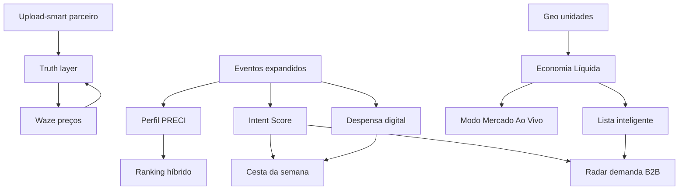

# Roadmap PRECIVOX — Inteligência de Consumo Alimentar

> **Tese:** O PRECIVOX oferta demanda ao consumidor (não espera).  
> **Categoria:** Infraestrutura de decisão de consumo — não comparador de preços.  
> **Princípios:** MVP first · baixo custo · IA híbrida · dados proprietários · IA explicável.

**Última atualização:** maio/2026  
**Horizonte:** 0–36 meses (MVP → escala → plataforma)

---

## Legenda

| Símbolo | Significado |
|---------|-------------|
| ✅ | Já existe no produto (base utilizável) |
| 🟡 | Parcial / precisa evoluir |
| 🔲 | A construir |
| P0 | Crítico para MVP da visão |
| P1 | Alto impacto pós-MVP inicial |
| P2 | Escala / moat |
| P3 | Visão unicórnio |

---

## Estado atual (baseline técnico)

| Área | Status | Referência no produto |
|------|--------|------------------------|
| Upload / integração catálogo parceiro | ✅ | `upload-smart`, `lib/upload-handler.ts`, `logs_importacao` |
| Busca + lista inteligente | ✅ | `/cliente/busca`, `ListaInteligentePanel` |
| Eventos comportamentais | ✅ | `lib/ai/event-collector.ts`, `UserEventType` |
| IA gestor (GROOC, health, promo, gôndola) | ✅ | `lib/ai/grooc-engine.ts`, engines B2B |
| Behavior engine + intenção | 🟡 | `lib/ai/behavior-engine.ts` |
| Rota / consolidação lista | 🟡 | `lib/lista-rota-ia.ts`, eventos de rota |
| Conversão lista (métricas gestor) | ✅ | `lib/ai/conversao-metrics.ts` |
| NPS + temas IA | ✅ | `NpsSurveyWidget`, `nps-themes` |
| Economia Líquida contextual | 🔲 | Visão estratégica |
| Crowd / Waze de preços | 🔲 | Visão estratégica |
| Perfil PRECI / despensa digital | 🔲 | Visão estratégica |
| API batch parceiro (automática) | 🔲 | Evolução do upload-smart |

---

## Visão por fases

```
FASE 0 — Fundação (agora)     │ Catálogo, busca, lista, IA gestor, upload parceiro
FASE 1 — MVP da visão (0–3m)  │ EL, truth layer, confirmação compra, crowd v1, Perfil PRECI
FASE 2 — PMF regional (3–9m)  │ Despensa, cesta semanal, modo mercado, sync parceiro, radar B2B
FASE 3 — Escala (9–18m)       │ Hiperlocal graph, oferta agregada, API parceiro, ML leve
FASE 4 — Plataforma (18–36m)  │ PRECI Network, intenção para indústria, expansão LATAM
```

---

# FASE 0 — Fundação (contínuo)

**Objetivo:** Estabilizar o que já existe para suportar as camadas de inteligência.

| # | Entrega | Pri | Status | Notas |
|---|---------|-----|--------|-------|
| 0.1 | Upload-smart confiável em produção | P0 | ✅ | CSV/XLSX/JSON → `produtos` + `estoques` |
| 0.2 | Documentação de export para parceiros | P0 | 🔲 | Campos alinhados ao `upload-handler` |
| 0.3 | Dashboard saúde do catálogo (gestor) | P0 | 🔲 | Último import, SKUs stale, erros |
| 0.4 | Expandir `UserEventType` (schema + API) | P0 | 🔲 | Ver épico 2.1 |
| 0.5 | Busca: exibir `atualizadoEm` no preço | P1 | 🔲 | Base da truth layer |
| 0.6 | GROOC: respostas sempre com fontes | P1 | 🟡 | Reforçar padrão explicável |

**Métricas:** taxa de sucesso de import · % produtos com preço &lt; 7 dias · tempo lista→busca

---

# FASE 1 — MVP da visão (meses 0–3)

**Objetivo:** Usuário sente “como vivi sem isso” em **economia real**, **confiança no preço** e **hábito pré-mercado**.

## Épico 1 — Economia baseada em contexto

| # | Feature | Pri | Depende de | Descrição |
|---|---------|-----|------------|-----------|
| 1.1 | **Economia Líquida™ (EL)** | P0 | Geolocalização unidade | `Δpreço − deslocamento − tempo×valor_hora` |
| 1.2 | EL na lista inteligente | P0 | 1.1 | “Vale ir ao mercado B: +R$ X líquidos” |
| 1.3 | EL no scan/foto (v1) | P1 | 1.1 | Foto → match catálogo → EL |
| 1.4 | Config valor do tempo | P1 | 1.1 | Default regional + ajuste usuário |
| 1.5 | Regra “Fique aqui” / “Vale X min” | P0 | 1.1 | Copy explicável, nunca caixa-preta |

**Métricas:** % recomendações EL aceitas · economia líquida confirmada/sessão

## Épico 2 — IA proprietária (camada PRECI)

| # | Feature | Pri | Depende de | Descrição |
|---|---------|-----|------------|-----------|
| 2.1 | Novos eventos | P0 | 0.4 | `preco_confirmado`, `preco_reportado`, `checkin_mercado`, `compra_confirmada`, `compra_parcial` |
| 2.2 | **Intent Score** heurístico | P0 | 2.1 | Decay temporal sobre eventos |
| 2.3 | Push “cesta provável” (48–72h) | P0 | 2.2 | Oferta de demanda v1 |
| 2.4 | Ranking híbrido (regras + histórico) | P0 | Behavior engine | Preço + distância + EL + preferências |
| 2.5 | LLM só para explicação (GROOC/B2C) | P1 | Dados estruturados | JSON in → texto out |

**Métricas:** D7 abertura pré-mercado · precisão intenção (proxy: confirmação compra)

## Épico 3 — Truth layer (consistência de preço)

| # | Feature | Pri | Depende de | Descrição |
|---|---------|-----|------------|-----------|
| 3.1 | Metadados em `estoques` | P0 | Migration | `fonte`, `confianca`, `verificadoEm` |
| 3.2 | UI: “Atualizado há X” + selo | P0 | 3.1, 0.5 | Transparência ao consumidor |
| 3.3 | Tiers parceiro (1/2/3) | P1 | Docs parceiro | Manual / diário / API |
| 3.4 | Alerta gestor: catálogo stale | P0 | 0.3 | Email/painel |

**Métricas:** % preços com confiança alta · NPS relacionado a preço errado

## Épico 4 — Waze dos preços (crowd v1)

| # | Feature | Pri | Depende de | Descrição |
|---|---------|-----|------------|-----------|
| 4.1 | Confirmar preço (3 taps) | P0 | 2.1 | Certo / mais caro / mais barato |
| 4.2 | Peso por reputação usuário | P1 | 4.1 | Score simples |
| 4.3 | Gamificação: níveis contribuidor | P1 | 4.1 | Observador → Guardião |
| 4.4 | Badge mercado “Preço verificado” | P1 | 3.1, 4.1 | Confiança bilateral |

**Métricas:** confirmações/DAU · divergências resolvidas &lt; 24h

## Épico 5 — Comportamento humano (Perfil PRECI)

| # | Feature | Pri | Depende de | Descrição |
|---|---------|-----|------------|-----------|
| 5.1 | **Perfil PRECI** (5 eixos) | P0 | Behavior engine | Planejador, marca, conveniência, explorador, urgente |
| 5.2 | UI espelho + edição pelo usuário | P0 | 5.1 | “Me trate como estratega” |
| 5.3 | Confirmação pós-compra (1 tap) | P0 | 2.1 | Substitui PDV: Sim / Parcial / Não fui |
| 5.4 | Relatório semanal gentil | P1 | 5.3 | Oportunidades, não culpa |

**Métricas:** % usuários com perfil calibrado · taxa confirmação compra

## Épico 6 — Loops de retenção (v1)

| # | Feature | Pri | Depende de | Descrição |
|---|---------|-----|------------|-----------|
| 6.1 | Streak economia confirmada | P1 | 5.3, 1.1 | Duolingo de economia real |
| 6.2 | Card share “economizei R$ X” | P1 | 1.1 | Loop social / viral |
| 6.3 | Notificação dia de mercado inferido | P0 | 2.2, 5.1 | Hábito pré-mercado |
| 6.4 | Inflação da **sua cesta** | P1 | Histórico listas | vs IPCA |

**Métricas:** D7/D30 · % compras com sessão PRECIVOX em 24h

### Entregáveis Fase 1 (checklist release)

- [ ] Economia Líquida em busca + lista
- [ ] Truth layer visível ao consumidor
- [ ] Crowd confirmar preço
- [ ] Confirmação pós-compra
- [ ] Perfil PRECI + Intent Score + 1 push semanal
- [ ] Dashboard saúde catálogo (gestor)

---

# FASE 2 — PMF regional (meses 3–9)

**Objetivo:** Tornar-se hábito semanal no(s) bairro(s) piloto e provar valor B2B mensurável.

## Épico 7 — Despensa e oferta ativa

| # | Feature | Pri | Descrição |
|---|---------|-----|-----------|
| 7.1 | **Despensa digital** | P0 | Ciclo de reposição por SKU (inferido) |
| 7.2 | **Cesta da semana** | P0 | IA monta, usuário aprova em 1 tap |
| 7.3 | Modo Emergência (“jantar hoje”) | P1 | 5 itens, 1 mercado, mínimo tempo |
| 7.4 | Espera que vale (promo timing) | P1 | Volatilidade regional por SKU |
| 7.5 | Atacado vs varejo | P2 | Volume familiar + EL |

## Épico 8 — Experiência em contexto

| # | Feature | Pri | Descrição |
|---|---------|-----|-----------|
| 8.1 | **Modo Mercado Ao Vivo** | P0 | Geofence + lista → UI corredor |
| 8.2 | Scan inteligente v2 | P1 | On-device OCR + embedding |
| 8.3 | Prova social hiperlocal anônima | P1 | “47 famílias do bairro…” |
| 8.4 | Raio familiar (conta compartilhada) | P2 | Listas + preferências casa |
| 8.5 | Troca inteligente explicável | P0 | Substitutos + histórico aceites |

## Épico 9 — Parceiro e sincronização

| # | Feature | Pri | Descrição |
|---|---------|-----|-----------|
| 9.1 | **Sync agendado** (reuso upload) | P0 | URL/SFTP/cron → `processarUpload` |
| 9.2 | API batch parceiro `POST /partner/v1/estoques` | P1 | Mesmo schema CSV |
| 9.3 | SLA + contrato dados (Tier 1–3) | P0 | Comercial + ops |
| 9.4 | Webhook preço alterado | P2 | Parceiros Tier 3 |

## Épico 10 — B2B: gestor como operador IA

| # | Feature | Pri | Descrição |
|---|---------|-----|-----------|
| 10.1 | **Radar de demanda do bairro** | P0 | Listas ativas agregadas (anonimizado) |
| 10.2 | Pricing assistido (aprovação 1 tap) | P0 | Promo engine + impacto estimado |
| 10.3 | Alerta ruptura preditiva | P1 | Busca alta + crowd sem confirmação |
| 10.4 | Benchmark preço regional | P1 | Percentil sem expor concorrente |
| 10.5 | Resumo semana + ações GROOC | 🟡 | Evoluir `resumo-semana-gestor` |

## Épico 11 — PRECI Graph (hiperlocal v1)

| # | Feature | Pri | Descrição |
|---|---------|-----|-----------|
| 11.1 | Agregação preço por CEP5/polígono | P0 | `nome_chave` + geo |
| 11.2 | Heatmap intenção (gestor) | P1 | Demanda latente |
| 11.3 | Rota multi-mercado otimizada | P1 | 2 paradas se EL total &gt; limiar |
| 11.4 | PRECI Index (cesta bairro) | P2 | Narrativa mídia/investidor |

**Métricas Fase 2:** retenção D30 · GMV intenção influenciada · conversão lista→visita · parceiros Tier 2+

---

# FASE 3 — Escala (meses 9–18)

**Objetivo:** Replicar cidade a cidade; moat de dados; receita B2B recorrente.

| Épico | Entregas principais |
|-------|---------------------|
| **12 — ML leve** | Basket completion, churn, elasticidade por usuário (batch) |
| **13 — Oferta agregada** | Mercado “aceita” cesta agregada da região |
| **14 — Crowd v2** | Foto etiqueta OCR, reputação mercado, anti-fraude |
| **15 — Embeddings catálogo** | Unificação SKU nacional com chave local |
| **16 — Parceiros âncora** | 3–5 redes / atacados por região piloto |
| **17 — Monetização** | SaaS gestor + insights CPG agregados + promo direcionada |

**Métricas:** densidade grafo (confirmações/km²) · ARR B2B · CAC orgânico (viral card)

---

# FASE 4 — Plataforma / visão unicórnio (meses 18–36)

| Pilar | Entrega |
|-------|---------|
| **PRECI Network** | API de intenção de compra alimentar (agregada, LGPD) |
| **Infraestrutura consumo** | Widget/SDK para apps parceiros |
| **Indústria (CPG)** | Tendência bairro, elasticidade, lançamento |
| **Tempo real** | Integração PDV seletiva (Tier 3 em escala) |
| **LATAM** | Playbook hiperlocal replicável |

**Métrica norte:** GMV de intenção influenciada × economia líquida entregue × densidade do grafo

---

# Mapa de dependências (críticas)



---

# As 10 ideias mais poderosas — encaixe no roadmap

| # | Ideia | Fase | Épico |
|---|-------|------|-------|
| 1 | Economia Líquida™ | 1 | 1 |
| 2 | Oferta de demanda (cesta provável) | 1–2 | 2, 7 |
| 3 | Despensa digital | 2 | 7 |
| 4 | PRECI Graph hiperlocal | 2–3 | 11 |
| 5 | Waze de preços | 1–3 | 4, 14 |
| 6 | Heatmap intenção (gestor) | 2 | 10, 11 |
| 7 | Modo Mercado Ao Vivo | 2 | 8 |
| 8 | Perfil PRECI explicável | 1 | 5 |
| 9 | Confirmação compra (PDV virtual) | 1 | 5 |
| 10 | Inflação da sua cesta | 1–2 | 6 |

---

# Squad e capacidade sugerida (MVP)

| Stream | Foco Fase 1 | ~capacidade |
|--------|-------------|-------------|
| **Core dados** | Truth layer, sync doc, saúde catálogo | 1 dev |
| **B2C experiência** | EL, crowd, Perfil PRECI, confirmação compra | 1–2 dev |
| **IA/Backend** | Eventos, Intent Score, ranking, pushes | 1 dev |
| **B2B** | Alertas gestor, radar v0, GROOC | 0.5 dev |
| **Produto/Ops** | SLA parceiro, onboarding mercado | 1 PM + ops |

---

# Riscos e mitigação

| Risco | Mitigação |
|-------|-----------|
| Preço desatualizado gera desconfiança | Truth layer + crowd + SLA parceiro |
| Custo de inferência LLM | LLM só explica; decisão = regras |
| Parceiro não reimporta | Dashboard stale + perda de selo |
| Escopo grande demais | Fase 1 = 6 épicos, release trimestral claro |
| Privacidade (LGPD) | Agregados B2B, opt-in, política já existente |

---

# Próximos passos imediatos (sprint 0 — 2 semanas)

- **Sprint 0:** ✅ código — [`ISSUES_SPRINT0.md`](./ISSUES_SPRINT0.md) · [`SPEC_ECONOMIA_LIQUIDA.md`](./SPEC_ECONOMIA_LIQUIDA.md)  
- **Sprints 1–3:** [`FASE1_SPRINTS.md`](./FASE1_SPRINTS.md) (`PREC-101` … `PREC-307`)  
- **Sprint 1:** UI truth layer + EL busca/lista + dashboard catálogo gestor  

---

## Referências internas

- Integração catálogo: `INTEGRACAO_UPLOAD_PRODUTOS_COMPLETA.md`, `components/UploadDatabase.tsx`  
- IA: `lib/ai/types.ts`, `behavior-engine.ts`, `grooc-engine.ts`  
- Sincronização busca: `IMPLEMENTACAO_SINCRONIZACAO.md`  
- Estratégia produto: conversas de visão (economia contextual, Waze, moats)

---

*Este roadmap é vivo: revisar ao fim de cada fase com métricas reais e ajustar prioridades P0/P1.*
